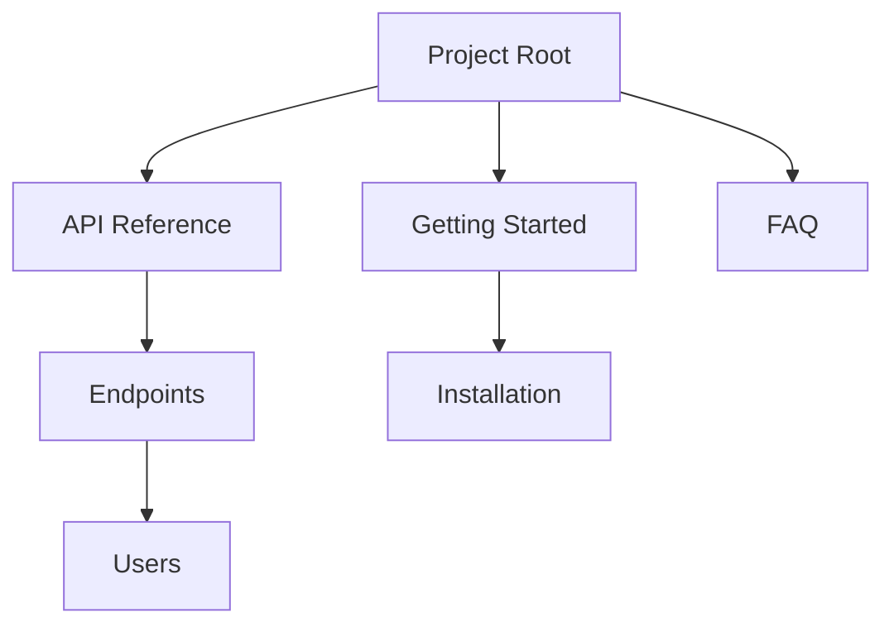

## Overview

Scraft empowers you to create, organize, and maintain comprehensive documentation for your projects. Focus on core capabilities like structuring content hierarchically, collaborating with teams, tracking changes through version history, and finding information quickly with powerful search tools. These features work together to make your docs scalable and user-friendly.

<Callout kind="info">
Scraft handles everything from simple wikis to complex API references, adapting to your project's needs.
</Callout>

## Key Features at a Glance

<Columns cols={2}>
  <Card title="Organizing Docs" icon="folder" href="#organizing">
    Build nested hierarchies with folders and pages for intuitive navigation.
  </Card>
  <Card title="Collaboration" icon="users" href="#collaboration">
    Share docs securely and invite team members to edit in real-time.
  </Card>
  <Card title="Version Control" icon="git-branch" href="#version-control">
    Track changes, revert updates, and maintain history effortlessly.
  </Card>
  <Card title="Search & Navigation" icon="search" href="#search">
    Find content instantly with full-text search and smart breadcrumbs.
  </Card>
</Columns>

## Organizing and Structuring Docs

Organize your documentation into logical structures using folders, subpages, and tags. Create a tree-like hierarchy that mirrors your project's architecture.



<Steps>
  <Step title="Create Folders" icon="folder-plus">
    Navigate to your workspace and click `New Folder`. Name it to reflect content categories like `guides` or `reference`.

````bash
# Example folder structure in Scraft
project/
├── introduction.mdx
├── features/
│   └── organizing.mdx
└── api/
    └── endpoints.mdx
````

  </Step>
  <Step title="Add Pages" icon="file-plus">
    Inside a folder, select `New Page` and choose MDX format for rich content.

    Use frontmatter to set titles and descriptions:

````mdx
---
title: My Feature Page
description: Detailed guide.
---
````

  </Step>
  <Step title="Tag for Filtering" icon="tag">
    Assign tags like `guide` or `api` to pages for easy categorization.
  </Step>
</Steps>

## Collaboration and Sharing Options

Invite teammates or share public links to collaborate seamlessly. Control permissions at the folder or page level.

<Tabs>
  <Tab title="Team Invite" icon="users">
    Generate invite links with roles: `editor`, `viewer`, or `admin`.

    <CodeGroup tabs="JavaScript,Python">
```javascript
// Scraft JS SDK - invite user
const scraft = new ScraftClient({ apiKey: 'YOUR_API_KEY' });
await scraft.inviteUser('user@example.com', { role: 'editor' });
```
```python
# Scraft Python SDK
from scraft import ScraftClient
client = ScraftClient(api_key='YOUR_API_KEY')
client.invite_user('user@example.com', role='editor')
```
    </CodeGroup>
  </Tab>
  <Tab title="Public Sharing" icon="share-2">
    Publish pages publicly or embed them via iframe.

    Set visibility in page settings: `public` or `unlisted`.
  </Tab>
</Tabs>

<Callout kind="tip">
Always review shared docs before publishing to ensure sensitive data like `{API_KEY}` is removed.
</Callout>

## Version Control and History

Scraft provides built-in Git-like version control. View diffs, restore previous versions, and branch for experiments.

<Expandable title="Advanced Version Workflow" default-open="false">
  Compare changes side-by-side:

  ```
  v1.2: Added search feature
  v1.1: Fixed navigation bugs
  v1.0: Initial structure
  ```

  Use the history panel to `Revert` or `Compare`.
</Expandable>

## Search and Navigation Tools

Leverage full-text search across all docs. Results include previews and highlight matches. Breadcrumbs and sidebar navigation keep you oriented.

| Feature | Description | Shortcut |
|---------|-------------|----------|
| Global Search | Query any term | `Ctrl+K` or `/` |
| Page Search | Find within page | `Ctrl+F` |
| Filters | By tag or folder | Sidebar menu |
| Breadcrumbs | Quick parent navigation | Top bar |

Integrate search into your workflow:

```javascript
// Embed Scraft search in your app
<ScraftSearch apiKey="YOUR_API_KEY" workspaceId="ws_123" />
```

These core features make Scraft your go-to tool for documentation. Start by [organizing your first folder](#organizing) and invite your team today.