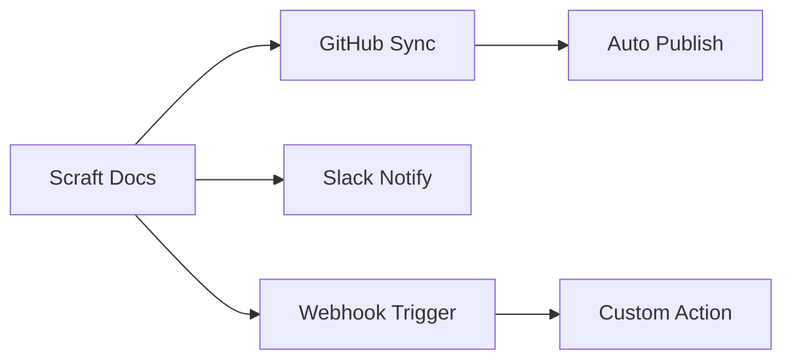

## Overview

Scraft integrates seamlessly with popular tools to streamline your documentation workflow. Connect your repository for automatic syncing, receive notifications in chat apps, set up webhooks for real-time updates, access the API for custom automation, and export docs in various formats.

<Columns cols={2}>
  <Card title="GitHub" icon="github" href="#github-integration">
    Sync documentation directly from your GitHub repositories.
  </Card>
  <Card title="Slack" icon="message-circle" href="#slack-notifications">
    Get instant notifications for doc updates and reviews.
  </Card>
  <Card title="Webhooks" icon="zap" href="#webhooks">
    Trigger actions on events like page publishes.
  </Card>
  <Card title="API" icon="code" href="#api-access">
    Build custom integrations with full API access.
  </Card>
</Columns>

## GitHub Integration

Connect Scraft to GitHub to automatically import, sync, and publish documentation from your repositories.

<Steps>
  <Step title="Create GitHub App" icon="settings">
    In your GitHub account, create a new GitHub App at `https://github.com/settings/apps`.
    
    Set permissions for repository contents (read/write) and metadata (read).
  </Step>
  <Step title="Configure Scraft" icon="link">
    In Scraft dashboard (`https://dashboard.example.com`), navigate to Integrations > GitHub.
    
    Paste your App ID, Client ID, and Client Secret.
  </Step>
  <Step title="Authorize Repository" icon="git-branch">
    Select the repository and grant permissions. Scraft will sync markdown files to docs pages.
  </Step>
</Steps>

<Callout kind="tip">
  Use branch protection rules in GitHub to require doc reviews before merging.
</Callout>

## Slack Notifications

Set up Slack notifications for key events like new doc versions or comments.

<Tabs>
  <Tab title="Page Published" icon="check-circle">
    Configure the webhook URL from your Slack app.
    
````bash
curl -X POST https://hooks.slack.com/services/YOUR/SLACK/APP \
  -H 'Content-type: application/json' \
  -d '{
    "text": "New docs published: https://docs.example.com/changelog"
  }'
````
  </Tab>
  <Tab title="Review Requests" icon="alert-triangle">
    Notify your team when docs need review.
    
````javascript
const payload = {
  text: `Review requested for docs: ${docUrl}`,
  channel: '#docs-review'
};
fetch(slackWebhookUrl, {
  method: 'POST',
  body: JSON.stringify(payload)
});
````
  </Tab>
</Tabs>

## Webhooks for Automation

Webhooks let you react to Scraft events in real-time. Subscribe to events like `doc.published` or `doc.updated`.

<CodeGroup tabs="JavaScript,cURL,Python">
```javascript
// Listen for webhook payload
app.post('/scraft-webhook', (req, res) => {
  const event = req.headers['x-scraft-event']; // e.g., "doc.published"
  const data = req.body;
  console.log(`Event: ${event}`, data);
  res.status(200).send('OK');
});
```

```bash
# Verify webhook signature if needed
curl -X POST your-webhook-url.com/scraft-webhook \
  -H "X-Scraft-Signature: YOUR_SIGNATURE" \
  -d '{"event": "doc.published", "doc_id": "123"}'
```

```python
from flask import Flask, request

app = Flask(__name__)

@app.route('/scraft-webhook', methods=['POST'])
def webhook():
    event = request.headers.get('X-Scraft-Event')
    data = request.json
    print(f"Event: {event}", data)
    return 'OK', 200
```
</CodeGroup>

## API Access for Custom Extensions

Use Scraft's REST API to create, update, and manage docs programmatically.

<ParamField path="docs/:id" param-type="GET" required="true">
  Retrieve a specific doc by ID.
</ParamField>

<ParamField header="Authorization" param-type="string" required="true">
  Bearer `{YOUR_API_TOKEN}`.
</ParamField>

<Request tabs="cURL,JavaScript">
````bash
curl https://api.example.com/v1/docs/123 \
  -H "Authorization: Bearer YOUR_API_TOKEN"
````

````javascript
const response = await fetch('https://api.example.com/v1/docs/123', {
  headers: {
    'Authorization': 'Bearer YOUR_API_TOKEN'
  }
});
const doc = await response.json();
````
</Request>

<Response>
```json
{
  "id": "123",
  "title": "Integrations Guide",
  "content": "MDX content...",
  "updated_at": "2024-10-15T10:00:00Z"
}
```
</Response>

## Exporting Documentation

Export your Scraft docs to PDF, HTML, or Markdown for sharing outside the platform.

<Expandable title="Export to PDF" default-open="true">
  1. Select the page or space in Scraft dashboard.
  2. Click Export > PDF.
  3. Customize theme and download.
  
  <Callout kind="info">
    PDF exports include table of contents and images.
  </Callout>
</Expandable>

<Expandable title="Batch Export to Markdown">
  Export entire spaces as ZIP of Markdown files for GitHub import.
</Expandable>



<Callout kind="success">
  Explore more in the [Quickstart](/quickstart) or [API Reference](/authentication).
</Callout>